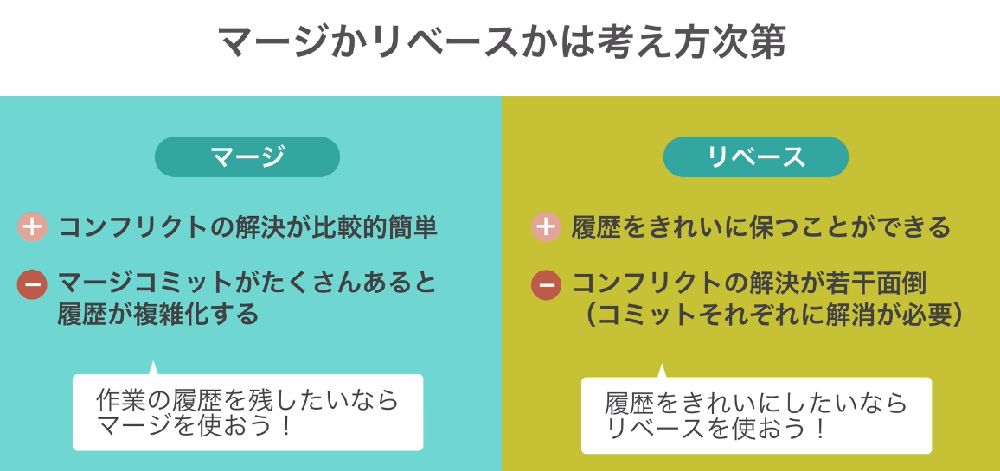

# Git Udemy講座メモ

## 0. Git概念
- ローカルワークツリー / ステージ / リポジトリの三階層でGitは運用されている
- ステージはコミットしたいものだけをローカルから分割するためにある

## 運用
- masterブランチをリリース用ブランチに専用にし、常にリリースのデータと同じ状態を保つ
- 開発は別でトピックブランチを切り、それをマージし、リリースする手段を推奨

- 開発の流れ(GitHub Flow)
  1. マスターブランチをリモートリポジトリの最新に更新
  2. 新規開発のためブランチを作成
  3. 開発作業を行い、リモートリポジトリにプッシュ
  4. そのブランチを元にレビュアーにプルリクを投げる
  5. レビューが通ればマスターブランチにマージ
  6. デプロイ

## 1. 設定変更
#### 初期設定
```bash
$ git config --global user.name "ユーザー名"
$ git config --global user.email "メールアドレス"

# 確認
$ git config user.name
$ git config user.email
```
#### コマンドにエイリアスを付ける
```bash
$ git config --global alias.ci commit
$ git config --global alias.st status
$ git config --global alias.br branch
$ git config --global alias.co checkout
```

#### バージョン管理しないファイル
```bash
# .gitignoreファイルを作成

# 書き方

# ルートディレクトリを指定
/root.html
# ディレクトリ以下を除外
dir/
# /以外の文字列マッチ 「*」
/*/*.css
```

## 2. Gitコマンド一覧
- git init：初期操作

- git add：ステージへの追加
- git commit：リポジトリへコミット
  - -m "コメント"：エディタを開かずにコメントを挿入
  - -v：差分を表示
- git status：現在のステータスを表示
- git diff：オプションなしの場合ローカルとステージとの差分を出力
  - --staged：ステージとコミットとの差分を出力
- git log：履歴を一覧表示
  - --oneline：コミット履歴の確認。一行表示
  - -n 数字：表示数を制限
  - -p：変更内容まで確認
- git rm：削除
  - <ファイル名>：ローカルとリポジトリの対象ファイルを削除
  - -r <ディレクトリ名>：ローカルとリポジトリの対象ディレクトリを削除
  - --cached<ファイル名>：ファイルを残してリポジトリのみ削除
- git mv<旧ファイル> <新ファイル>：ファイルの移動、ファイル名の変更(ステージに記録されるのでコミットが必要)

## 3. GitHubコマンド一覧
#### リモートリポジトリの新規追加
- git remote add <リモート名> <リモートURL>：GitHubを新規追加(URLを登録することにより毎回GitHubにプッシュするときにURLを打ち込む必要がなくなる、originに登録される)
- git push <リモート名> <ブランチ名>：GitHubへ送信
  - Ex：git push origin masterなど
-  git push -u origin master：最初にやっておくと後でgit pushだけでよくなる

#### リモートリポジトリの情報表示
```bash
$ git remote：リモートリポジトリを表示
$ git remote -v：URLを表示

# 詳細情報を表示
$ git remote show <リモート名>
```

#### リモートリポジトリの変更・削除
```bash
# リモートリポジトリ名変更
$ git remote rename <旧リモート名> <新リモート名>
# リモートリポジトリ削除
$ git remote rm <リモート名>
```

#### リモートリポジトリから取得
```bash
# fetch編
## リモートブランチというローカルリポジトリに反映させるだけでローカルワークツリーには影響を与えない
$ git fetch <リモート名>
$ git branch -a：作成されたブランチを確認
$ git checkout <ブランチ名>：ブランチの切り替え
# 取り込み先にブランチを切り替えてマージする
$ git merge origin/master

# pull編
## リモートから情報を取得してマージまでを一度にやりたい場合
$ git pull <リモート名> <ブランチ名>
# リモート名、ブランチ名は省略可能
# git fetchとgit mergeコマンドを効果は同じ
# pullは現在のブランチに取り込んだ内容がマージされるため危険。慣れないうちはfetchを使用することが推奨。

$ git pull --rebase <リモート名> <ブランチ名>
# マージコミット履歴が残らないためGitHubの内容を取得したい時に使用
```

#### 変更取り消し
```bash
$ git checkout -- <ファイル名> or <ディレクトリ名>
# 全変更取り消し
$ git checkout -- .
``` 

#### ステージ追加を取り消し
※ステージからの取り消しのみでワークツリーには変更を加えない
```bash
$ git reset HEAD <ファイル名> or <ディレクトリ名>
# 全取り消し
$ git reset HEAD .
```

#### コミットの修正
※リモートリポジトリにPushしたものはコミットしなおしはダメ！！
```bash
# 直前のコミットをやり直す
$ git commit --amend

# 複数コミットをやり直す
$ git rebase -i <コミットID>
$ git rebase -i HEAD~3：3つ前まで修正
# 1 コミットエディタが立ち上がり、変えたいとこをpickからeditに修正
# 2 内容を修正し、git commit --amend
# 3 git rebase --continueを打ち、次に移る

# 並べ替え、削除
# コミットエディタにて並び替えや削除を行う
$ git rebase -i HEAD~数字

# コミットをまとめる
$ git rebase -i HEAD~数字
# pickをsquashに修正　
```

#### ブランチとマージ
※ブランチはコミットを刺したポインタ
```bash
# ブランチ一覧 & 現在のブランチ表示
$ git branch
# ブランチ一覧表示(リモート含む)
$ git branch -a

# 新規ブランチ作成
$ git branch <新ブランチ名>

# ブランチの切替
$ git checkout <既存のブランチ名>

# ブランチの作成&切替
$ git checkout -b <新ブランチ名>

# マージ
# ※作業中のブランチにマージすることに注意
$ git merge <ブランチ名>
$ git merge <リモート名/ブランチ名>

# ブランチ名変更
$ git branch -m <ブランチ名>

# ブランチ削除
git branch -d <ブランチ名>
# 強制削除
git branch -D <ブランチ名>
※小文字の-dの場合はmasterにマージされていない、変更が残っている場合は削除しない
```

#### コンフリクト
```bash
# 
$ 
```

#### リベース
- ※修正を取り込む点ではマージと同じだが、リベースは履歴まで取り込み、親コミットを取り込まれたコミット元にし、コミットの整理を行う
  - マージ　：変更箇所の取り込み
  - リベース：変更箇所と履歴の取り込み
- **※GitHubにプッシュしたコミットをリベースするのはNG**
```bash
$ git rebase <ブランチ名>

# 一連の流れ
# 1 featureブランチへ移動
# 2 featureブランチにてmasterブランチをリベースする(git rebase master)
# 3 ログを確認
# 4 masterブランチへ移動
# 5 featureブランチをマージ(git merge feature)
```


#### タグ
```bash
# タグ一覧を表示
$ git tag
# パターン指定した一覧表示
$ git tag -l "文字列"

# タグの詳細表示
$ git show [タグ名]

# タグは2種類
# 注釈付きタグ
$ git tag -a "タグ名" -m "メッセージ"
# 軽量タグ
$ git tag [タグ名]

# 昔のコミットにタグを付与
$ git tag [タグ名] [コミットNo]

# タグをリモートリポジトリに送信
$ git push [] [タグ名]
# タグをリモートリポジトリに一斉送信
$ git push [リポジトリ名] --tags
```

#### 作業を一時避難
```bash
# 一時避難
$ git stash
# 避難のリスト表示
$ git stash list

# 避難を復元
# popスタッシュリストからそのエントリを削除します。
# applyはスタッシュリストから変更を削除しません。
$ git stash pop
# 最新の作業を復元
$ git stash apply
# ステージの状況も復元
$ git stash apply --index

# 最新の避難した作業を削除
$ git stash drop
# 避難した全作業を削除
$ git stash clear
```